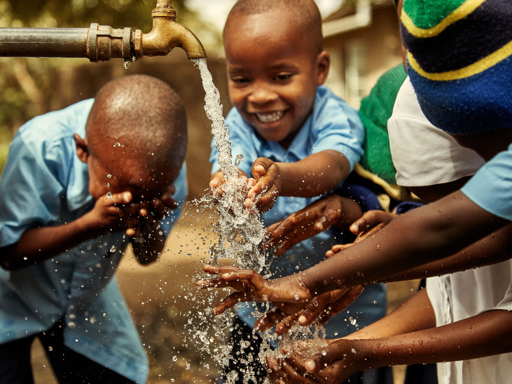
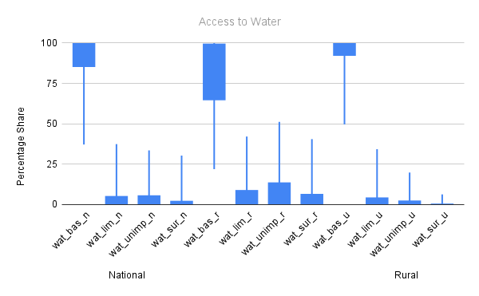
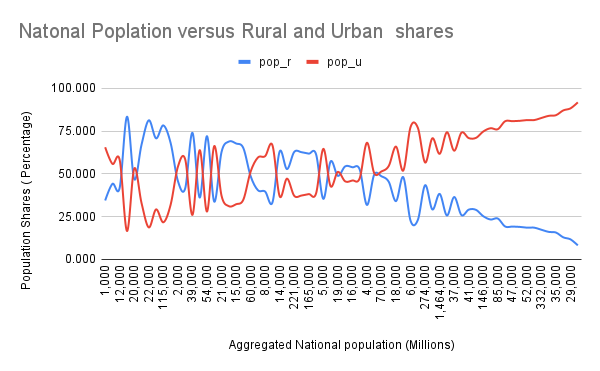
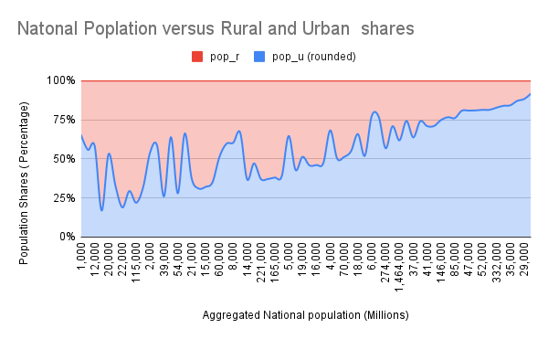

# **ACCESS TO SAFE AND AFFORDABLE WATER (SDG-6)**
**_Google Sheets Project_**

## **INTRODUCTION**
This project investigates access to safe and affordable drinking water, a critical aspect of Sustainable Development Goal 6 (SDG-6). Using data from the WHO/UNICEF Joint Monitoring Programme (JMP) on water supply, sanitation, and hygiene for 2020, we explore various factors influencing water accessibility, including population size, area type, and income group.

## **PROBLEM STATEMENT**
Access to clean drinking water remains a challenge in many regions, leading to health risks and socio-economic issues. This project seeks to analyze and visualize water accessibility levels across different population groups and geographic areas, identifying key disparities and trends.

## **SKILL DEMONSTRATION**
- **Data Sourcing and Cleaning**: Handling CSV files, dealing with different separators, and checking for missing values.
- **Google Sheets Functions**: Using formulas like `COUNTA()`, `ROUND()`, and `ABS()` to process data.
- **Data Transformation**: Creating new features like population estimates and water access levels.
- **Data Analysis**: Exploring population size, area-wise water access, and income-based trends.
- **Data Visualization**: Using line charts, stacked column charts, box-and-whisker plots, and pivot tables.

## **DATA SOURCING**
The dataset is sourced from the **WHO/UNICEF JMP Estimates on the Use of Water (2020)**. It includes information on the percentage of the population with access to different levels of water service (basic, limited, unimproved, surface) across various regions and income groups.

## **DATA TRANSFORMATION**
### **Steps Taken**
1. **Importing the Data**
   - The dataset was downloaded as a CSV file and imported into Google Sheets.
   - The separator type was corrected to ensure proper column alignment.
   - Missing values (`NAN`) were identified and handled.

2. **Feature Engineering**
   - Created a new column `value_cnt` to count the number of valid values per row.
   - Added `pop_u_val`, which represents the number of people living in urban areas.
   - Calculated `pop_n (m)`, rounding national population estimates to millions.
   - Created `wat_bas_n (rounded)`, adjusting water access values exceeding 100%.
   - Introduced `pop_u (rounded)` and `pop_r (rounded)` for cleaner visualizations.

## **MODELLING**
While this project does not involve predictive modeling, various statistical analyses were applied:
- **Percentage Difference**: Comparing dataset values with global estimates.
- **Measures of Central Tendency and Spread**: Mean, median, mode, interquartile range (IQR), and standard deviation.
- **Pivot Tables**: Summarizing national access by income groups.

## **ANALYSIS & VISUALIZATION**
1. **Investigating Population Size**
   - Compared dataset population with world estimates.
   - Created a **line chart** for national, urban, and rural population shares.
   - Used **percentage difference** to measure dataset accuracy.

Line                                                      |         100% Stacked
:----------------------------------------------------------|--------------------------------------------------------------:
  | 

2. **Investigating Access by Area**
   - Calculated max, min, mean, median, and IQR for each access level.
   - Created a **box-and-whisker plot** (candlestick chart) for national, urban, and rural water access.

3. **Investigating Access by Population Size**
   - Used **100% stacked column charts** to compare water access by national, urban, and rural population sizes.

4. **Investigating Access by Income Group**
   - Created a **pivot table** summarizing population, urbanization, and access levels for different income groups.
   - Converted income group text to numeric format for easier sorting and visualization.

## **CONCLUSION**
This analysis reveals:
- Higher-income countries generally have better water access.
- Urban areas tend to have greater access to at least basic water services than rural areas.
- Population size and income group significantly impact water availability.
- Some anomalies in the dataset (e.g., values exceeding 100%) highlight data collection challenges.

