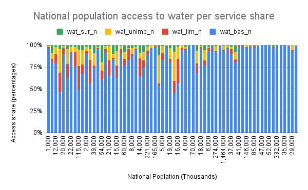
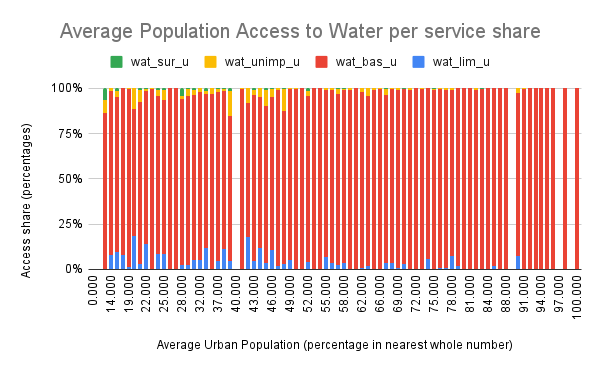
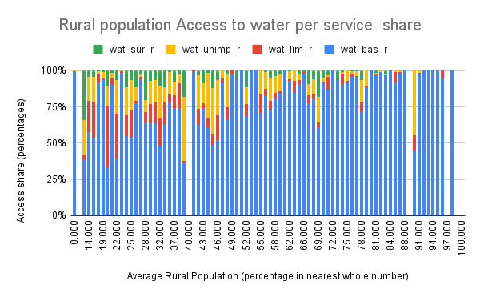
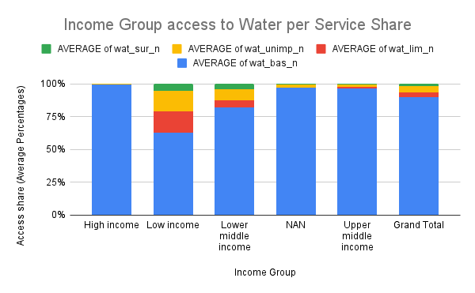
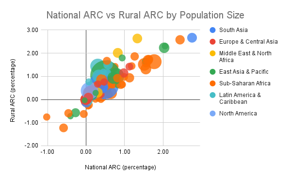

# **ACCESS TO SAFE AND AFFORDABLE WATER (SDG-6)**
**_Google Sheets Project_**

## **INTRODUCTION**
This project investigates access to safe and affordable drinking water, a critical aspect of Sustainable Development Goal 6 (SDG-6). Using data from the WHO/UNICEF Joint Monitoring Programme (JMP) on water supply, sanitation, and hygiene for 2020, we explore various factors influencing water accessibility, including population size, area type, and income group.

## **PROBLEM STATEMENT**
Despite global efforts, millions of people still lack access to clean drinking water, impacting public health and socio-economic development. This project explores historical trends, regional disparities, and the annual rate of change (ARC) in water access, providing insights into the progress made over the years.

## **SKILL DEMONSTRATION**
- **Data Sourcing and Cleaning**: Handling CSV files, dealing with different separators, and checking for missing values.
- **Google Sheets Functions**: Using formulas like `COUNTA()`, `ROUND()`, and `ABS()` to process data.
- **Data Transformation**: Creating new features like population estimates and water access levels.
- **Data Analysis**: Exploring population size, area-wise water access, and income-based trends.
- **Data Visualization**: Using line charts, stacked column charts, box-and-whisker plots, and pivot tables.

## **DATA SOURCING**
The project uses two datasets:
1. **WHO/UNICEF JMP Estimates on the Use of Water (2020)** – A snapshot of global water access.
2. **WHO/UNICEF JMP Estimates (2000-2020** – A time-series dataset for analyzing historical trends.

Additionally, a **Regions.csv** file was used to classify countries into geographic regions.

## **DATA TRANSFORMATION**
### **Phase 1: Understanding the Data**
1. **Importing the Data**
   - Cleaned and formatted CSV data for analysis.
   - Identified and handled missing values (`NAN`).

2. **Feature Engineering**
   - **Created value counts (`value_cnt`)** to check for missing data.
   - **Calculated `pop_u_val`** (urban population estimates).
   - **Rounded population estimates (`pop_n (m)`)** for better visualization.
   - **Adjusted water access values (`wat_bas_n (rounded)`)** to correct invalid percentages over 100%.

3. **Data Summary**
   - Used **measures of central tendency and spread (mean, median, IQR, standard deviation)**.
   - Compared **dataset population** with global estimates.
   - **Visualized** population distributions using line charts.
---
### **Phase 2: Transforming the Data**
1. **Investigating Year Representation**
   - Imported **2000-2020 dataset** to track changes over time.
   - Sorted data by **country and year** to observe trends.
   - Created `y_diff` to calculate **average years between data collection** per country.
   - Used **histograms** to analyze the **distribution of recorded years**.

2. **Investigating Annual Rates of Change (ARC)**
   - Calculated **Annual Rate of Change (ARC)** for national (`ARC_n`), rural (`ARC_r`), and urban (`ARC_u`) water access.
   - Used the formula:  
     \[
     ARC_x = \frac{P_{x,y2} - P_{x,y1}}{Y2 - Y1}
     \]
   - Addressed missing values using `IFERROR()` and set invalid ARC values to `"null"`.
   - **Summary statistics**: Mean, min, max of ARC for each population group.
   - **Key insight**: Rural water access showed **higher ARC** than urban/national, indicating faster progress in rural areas.

3. **Investigating Access by Area**
   - Counted countries with:
     - **Full water access** in both recorded years.
     - **No change in access (ARC = 0)**.
     - **Decreasing water access (ARC < 0)**.
   - Used `COUNTIFS()` to categorize countries based on water access trends.
   - Visualized **urban vs. rural ARC difference** using **histograms**.

4. **Investigating Access by Region**
   - Mapped each country to a **region** using `LOOKUP()`.
   - Created **pivot tables** summarizing:
     - Number of countries per region.
     - **Average ARC** (national, rural, urban).
   - **Key Insight**: Sub-Saharan Africa, with the largest population lacking safe water, will only reach full access by **2080** at the current rate.

## **MODELLING**
Although this project does not include predictive modeling, it applies **statistical analysis** to identify trends in water accessibility.

- **Percentage Difference**: Comparing dataset values with global estimates.
- **Annual Rates of Change (ARC)**: Measuring progress over time.
- **Pivot Tables**: Summarizing water access by **income group and region**.

## **ANALYSIS & VISUALIZATION**
1. **Investigating Population Size**
   - Compared dataset population with world estimates.
   - Created a **line chart** for national, urban, and rural population shares.
   - Used **percentage difference** to measure dataset accuracy.

Line                                                      |         100% Stacked
:----------------------------------------------------------|--------------------------------------------------------------:
  | 

2. **Investigating Access by Area**
   - Calculated max, min, mean, median, and IQR for each access level.
   - Created a **box-and-whisker plot** (candlestick chart) for national, urban, and rural water access.

3. **Investigating Access by Population Size**
   - Used **100% stacked column charts** to compare water access by national, urban, and rural population sizes.
   
   
   

4. **Investigating Access by Income Group**
   - Created a **pivot table** summarizing population, urbanization, and access levels for different income groups.
   - Converted income group text to numeric format for easier sorting and visualization.

   

5. **Water Access Trends Over Time**
   - **Histograms** showing year distribution in the dataset.
   - **Annual Rate of Change (ARC) visualization** for national, rural, and urban areas.
   - **Regional comparison of ARC values** to determine the progress made across different parts of the world.
  
   

## **CONCLUSION**
This project highlights:
1. **Persistent disparities in water access** – High-income regions have significantly better water services than low-income areas.
2. **Faster improvement in rural areas** – The **Annual Rate of Change (ARC)** is higher in rural regions, but many still lack basic access.
3. **Sub-Saharan Africa faces the greatest challenge** – Without accelerated progress, universal water access may not be achieved until **2080**.
4. **Year representation gaps** – Some countries have missing data points, affecting trend analysis.
5. **Policy Implications** – Urgent interventions are needed in **low-income and rural areas** to improve water access.
